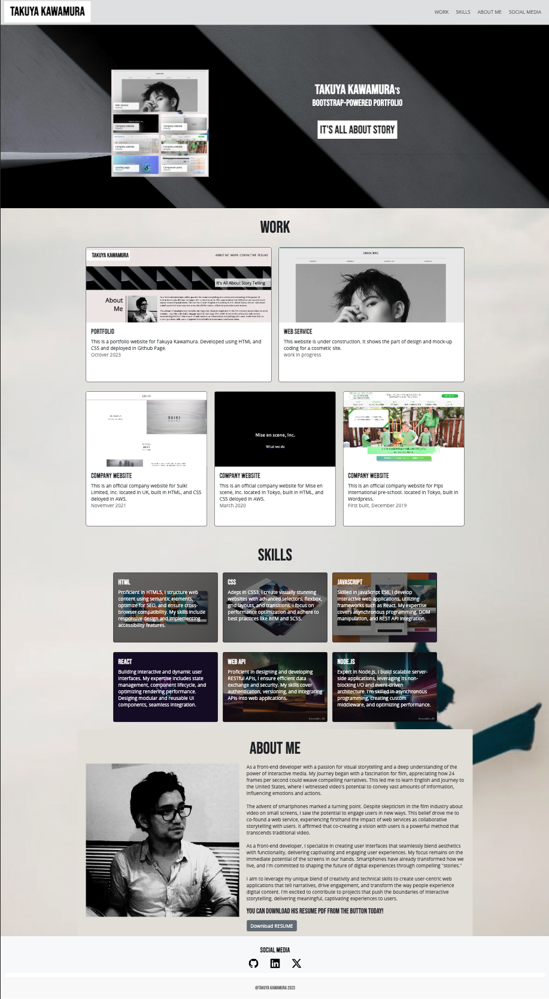

# Bootstrap-Portfolio

<!-- ABOUT THE PROJECT -->

<!-- TABLE OF CONTENTS -->

  
Table of Contents

  <ol>
    <li>
      <a href="#about-this-project">About this Project</a>
      <ul>
        <li><a href="#built-with">Built With</a></li>
      </ul>
    </li>
    <li><a href="#roadmap">Roadmap</a></li>
    <li><a href="#important-note">Important Note</a></li>
    <li><a href="#website-preview">Website Preview</a></li>
    <li><a href="#credits">Credits</a></li>
    <li><a href="#license">License</a></li>
    <li><a href="#contact">Contact</a></li>
  </ol>

## About this project

This is UX and Advanced CSS: Bootstrap Portfolio for bootcamp. There is a specific instruction of directory structure in this project. Recreating my portfolio is the goal with mutiple conditions following in the roadmap. This bootstrap techniques includes layout grid, utilities, card, flexbox, button and some other small parts of components. This website will be fully responsive using bootstrap for mobile/tablet and desktop.

### Built With

- ![HTML]
- ![CSS]
- ![BOOTSTRAP]

## Roadmap

- [x] Have a navigation bar
- [x] Have navigation menu at the top and use the Bootstrap's documentation. Or create your own navbar by applying the correct Bootstrap classes to your HTML.
  - [x] Include links that are applicable to your portfolio
  - [x] Links should navigate to the appropriate sections
- [x] Create a hero section with a jumbotron featuring your picture, your name, and any other information you'd like to include.
- [x] Follow a work section that has to include the followings
  - [x] A section displaying your work in grid.
  - [N/A] If you need to use placeholder image use placehold.coLinks to an external site.
  - [x] Use Bootstrap cards for each project.
  - [x] The description should give a brief overview of the work.
  - [x] Each project will eventually link to your class project work!
- [x] Create a skills section that list out the skills you expect to learn from the bootcamp
- [x] Get an about/contact section that has An About Me section in the same row.
- [x] Include a footer section has all hyperlinks should have a hover effect and all buttons should display a box shadow upon hover.
- [x] Use the media queries for your bootstrap solution
- [] Check the class names and comments that have clear and understandable.
- [x] deploy your new Bootstrap-powered portfolio to GitHub Pages.

## Important note

This is the Takuya's Bootstrap-powered portfolio mock-up for the bootcamp project. The base design is provided. The structure of Bootstrap is guided by the assignments. Some of pictures are taken from copy-right free websites or AI-generated.

### Website Preview

For mobile/tablet with max-width of 768 px

  
  
  

For desktop

  

You can find the github preview page below
[github preview page](https://sebecjeanluc.github.io/Bootstrap-Portfolio/)

### Credits

This is a mock-up website for the bootcamp. Some of the images and their codes are not copyrigt free.

### Third-party service

[Google fonts](https://fonts.google.com/)

### License

Distributed under the MIT License. See `LICENSE.txt` for more information.

## Contact

Tak Kawamura - [@\_takuyakawamura](https://twitter.com/_takuyakawamura) - tkawamura11@gmail.com

<!-- MARKDOWN LINKS & IMAGES -->
<!-- https://www.markdownguide.org/basic-syntax/#reference-style-links -->

[HTML]: https://img.shields.io/badge/HTML-orange
[CSS]: https://img.shields.io/badge/CSS-blue
[BOOTSTRAP]: https://img.shields.io/badge/Bootstrap-purple
